# Microsoft Defender Lab: Troubleshooting Functionality & Running an EDR Detection Test

## Objective

While building out my Microsoft Defender for Endpoint lab, I ran into a handful of real-world issues — licensing, device onboarding, and prerequisites for Microsoft's EDR detection test. This writeup walks through each problem as it came up and how I resolved it, ending with a live incident generated by Defender's official detection test.

**Environment:**
- Windows 10 x64 VM (test endpoint)
- Microsoft 365 E5 (licensing for Defender features)
- Microsoft Defender for Endpoint (security.microsoft.com)

---

## 1. Portal Access Issue — Missing License

My first roadblock was inside the Defender portal itself: the **Incidents** page returned *"You can't access this section — check with your administrator for the role-based access permissions to see the data."* This happens when the signed-in account doesn't have a Microsoft 365 license that includes Defender for Endpoint.

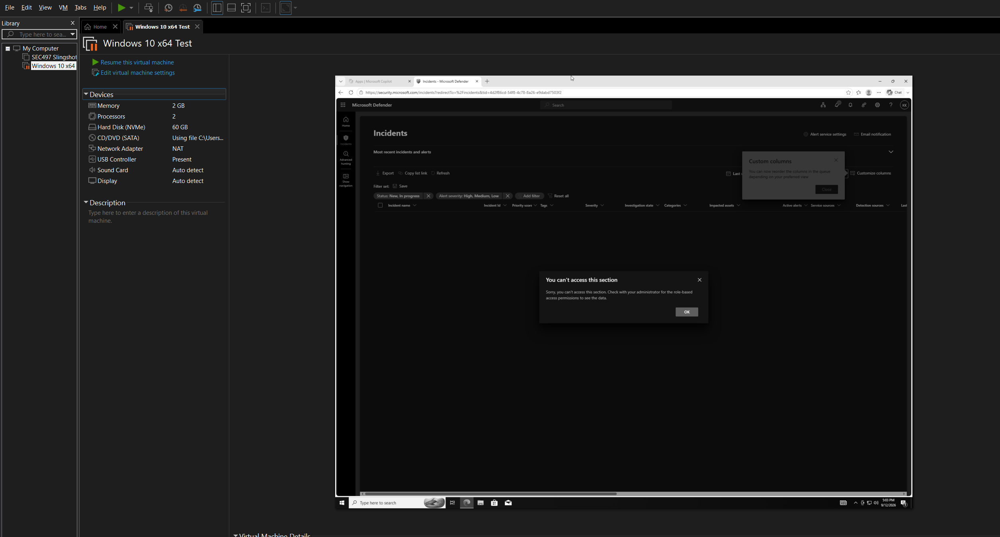

**Fix:** I went into the Microsoft 365 admin center and confirmed my lab account had a **Microsoft 365 E5** license assigned (Active users → my account → Licenses and apps).

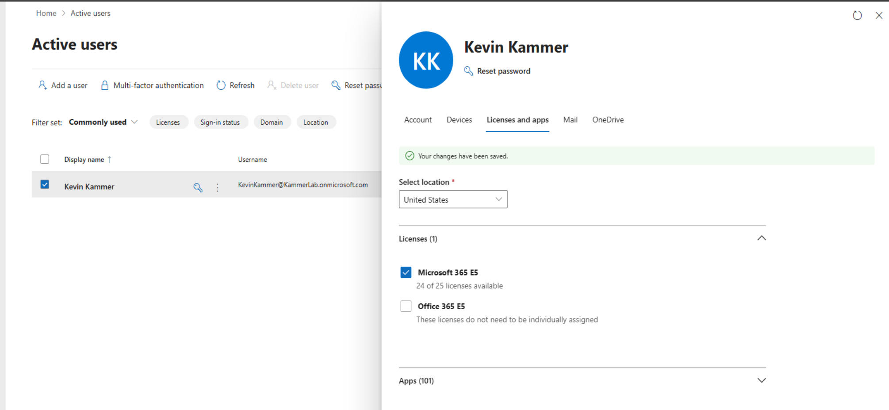

---

## 2. Onboarding the Test Device

With licensing sorted, Defender still wasn't pulling incidents — because the VM itself hadn't been onboarded yet. I navigated to **Settings → Endpoints → Onboarding** in the Defender portal and downloaded the onboarding package (Local Script deployment method, for up to 10 devices).

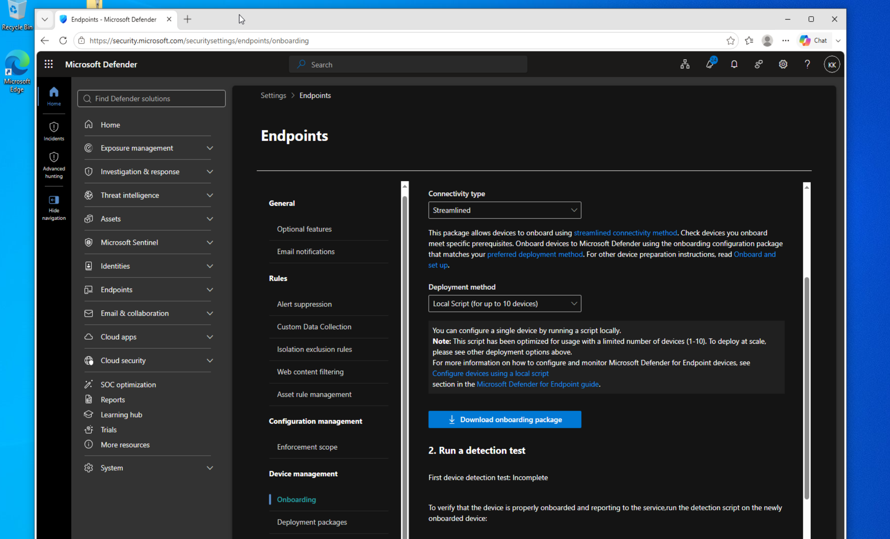

Running the onboarding script on the VM completed successfully:

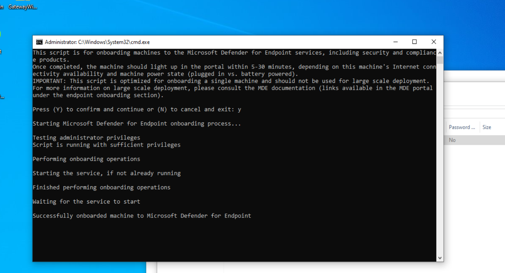

---

## 3. Confirming the Device Appeared in Defender

Right after onboarding, the new VM wasn't yet showing up as a device in the portal — onboarding can take 5–30 minutes to sync, so this was expected. After waiting, the device (`desktop-uogq7hk`) showed up in **Assets → Devices** as a newly discovered device.

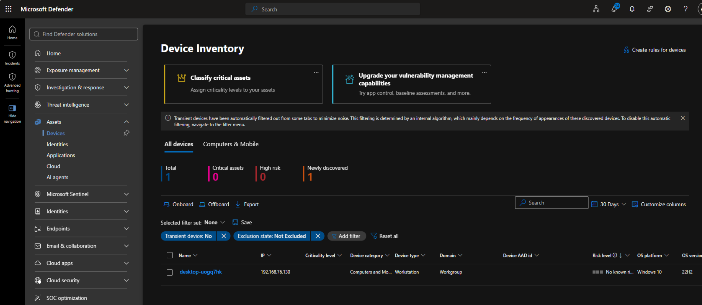

---

## 4. Preparing for Microsoft's EDR Detection Test

With the device onboarded, the next step was running [Microsoft's official EDR detection test](https://learn.microsoft.com/en-us/defender-endpoint/edr-detection) to confirm Defender was actually detecting activity, not just reporting status.


The test works by downloading a file from `127.0.0.1` over port 80, which requires the machine to be listening on that port. To enable this, I went to **Control Panel → Programs → Turn Windows features on or off** and checked the box for **Internet Information Services (IIS)**.

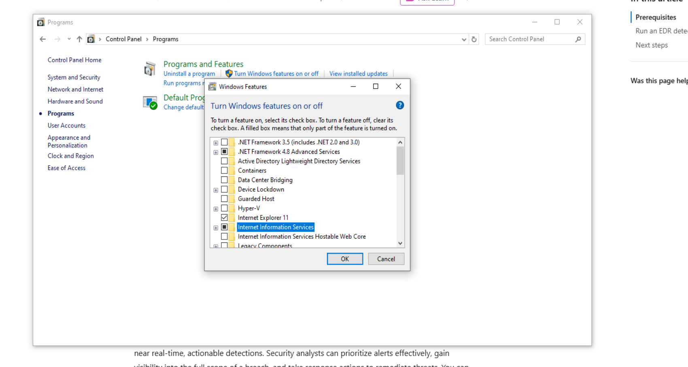

IIS is Windows' built-in web server — it lets the machine host and serve files over HTTP. Here, it's only there to serve the test file (`1.exe`) so the test command has something to download from `127.0.0.1:80`, which is what triggers the alert.

After enabling IIS, I reran the connectivity test — port 80 was initially not listening, but succeeded once IIS finished registering:

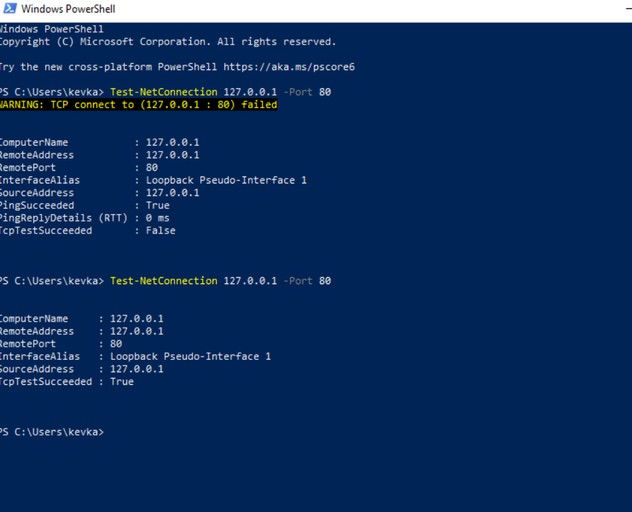

---

## 5. Running the EDR Detection Test

With port 80 confirmed listening, I ran Microsoft's test command, which downloads a benign test file and executes it to simulate malicious behavior:

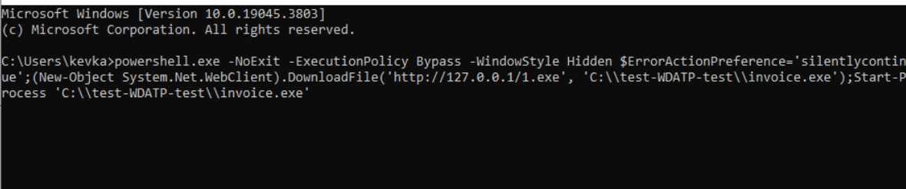

---

## 6. Result: Live Incident Detected

The test triggered a real incident in Defender **"Execution incident on one endpoint"** confirming the sensor and detection pipeline were fully working end to end.

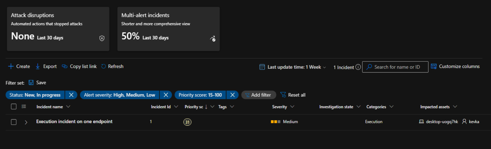

Drilling into the incident shows the full attack story: the `kevka` user context, the `desktop-uogq7hk` device, the two processes spawned, and the connection back to `127.0.0.1`, along with both triggered alerts (including the `[Test Alert] Suspicious PowerShell commandline` signature).

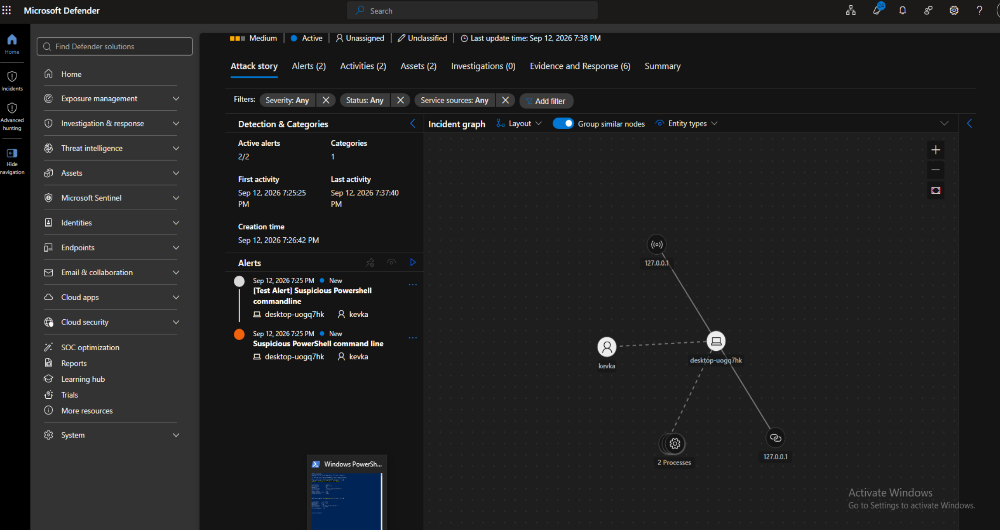

---

## 7. Hunting the Alerts with KQL (Advanced Hunting)

Rather than only browsing alerts in the Incidents queue, I generated a couple more test alerts, including a classic **EICAR test file** (the industry-standard, harmless antivirus test string) and used Defender's **Advanced Hunting** page (Hunting → Advanced hunting → *Query in editor*) to pull them back with KQL.

**First pass — basic alert lookup:**

```kql
AlertInfo
| where Timestamp > ago(1d)
| project Timestamp, AlertId, Title, Severity, Category
| order by Timestamp desc
```

This pulled back the alert Defender generated when it caught the EICAR file:

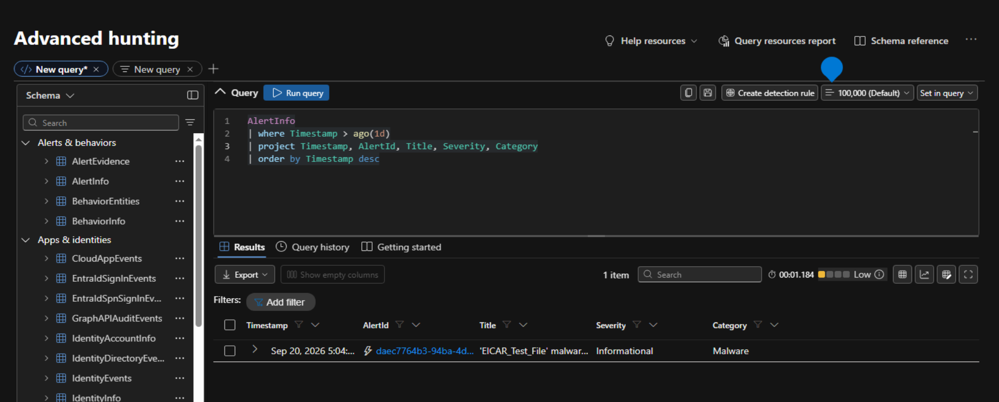

| Timestamp | Alert | Severity | Category |
|---|---|---|---|
| Sep 20, 2026 5:04:30 PM | `'EICAR_Test_File' malware was prevented` | Informational | Malware |

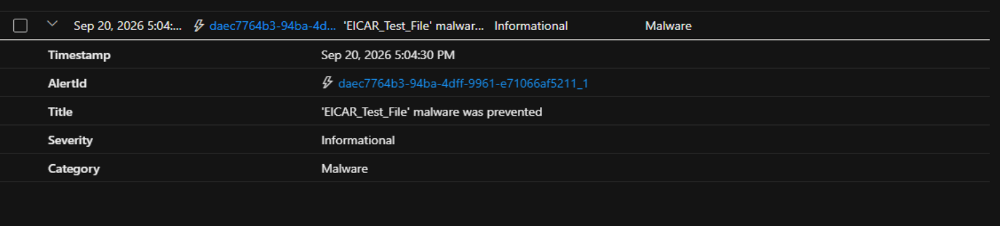

**Second pass — joining in the device name:**

`AlertInfo` alone doesn't say which device an alert happened on — that lives in a separate table, `AlertEvidence`. I joined the two on `AlertId` (filtering `AlertEvidence` down to just `Machine`-type entities) to pull the device name into the same results:

```kql
AlertInfo
| join kind=inner (
    AlertEvidence
    | where EntityType == "Machine"
    | project AlertId, DeviceName
) on AlertId
| project Timestamp, AlertId, Title, Severity, Category, DeviceName
| order by Timestamp desc
```

This confirmed the alert traced back to the same lab VM used throughout this project, `desktop-uogq7hk`:

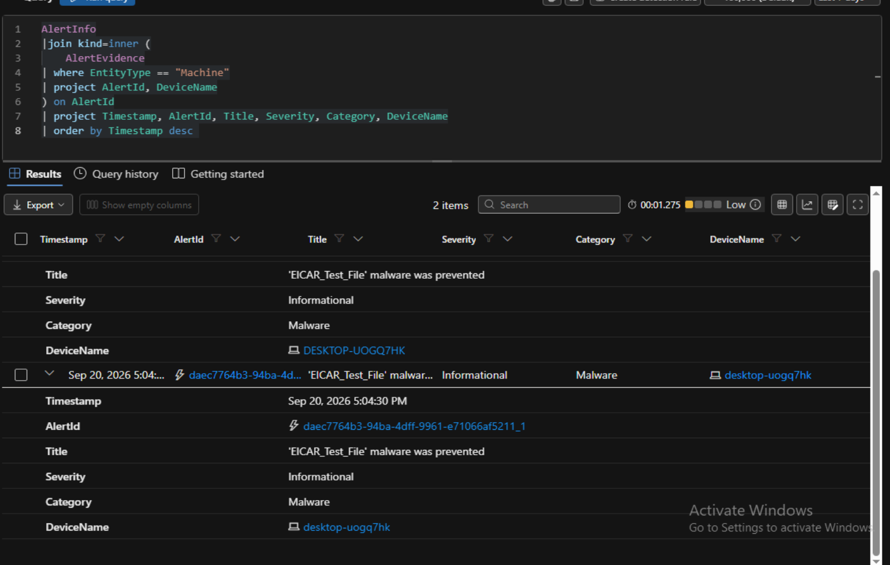

---

## Summary / Lessons Learned

- A Defender "access denied" error is often a **licensing** problem (Microsoft 365 E5), not a permissions bug.
- A device won't generate incidents until it's **onboarded**, and onboarding can take up to 30 minutes to reflect in the portal — don't assume it failed just because it's not immediate.
- Microsoft's EDR detection test needs the target machine **listening on port 80** (via IIS or another web server) to serve the test payload — this is easy to miss if you jump straight to running the test command.
- Successfully generating and reviewing a test incident is a good way to validate that Defender's full pipeline — sensor, cloud detection, and alerting — is actually working, not just "connected."
- `AlertInfo` doesn't carry device context by itself — joining it with `AlertEvidence` (filtered to `Machine` entities) on `AlertId` is the pattern for pulling the affected device into alert-level queries.

---

## Next Steps / Open Questions

A few things to dig into as this lab grows:

- Confirm which token/session identifier is most reliable to join on across tables (e.g., `LogonId` vs. a sign-in `CorrelationId`) in Advanced Hunting — this may vary table to table.
- Check whether the Microsoft 365 E5 trial's Defender for Endpoint tier includes full Advanced Hunting retention, or if there's a data retention limit to plan around.
- Add a second VM (a lightweight client) to generate more realistic cross-device sign-in activity to hunt across.
